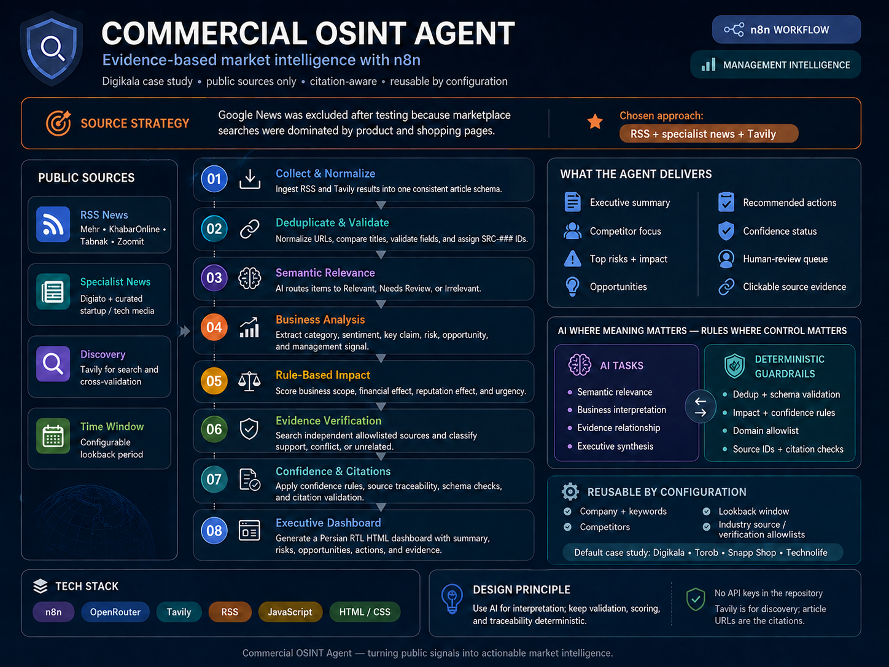

# Commercial OSINT Agent

> A configurable n8n workflow for collecting, validating, cross-checking, and turning public market signals into an evidence-based executive intelligence dashboard.

<p align="center">
  
</p>

## Overview

The **Commercial OSINT Agent** is an n8n-based workflow designed to monitor a company and its competitors using public information, reduce noisy or duplicated results, verify important claims, and generate a management-ready Persian RTL dashboard with traceable source citations.

The current repository uses **Digikala** as the case study and monitors:

- Digikala
- Torob
- Snapp Shop
- Technolife

> ⚠️ **Case Study & Affiliation Notice**
>
> **Digikala is used in this repository solely as an example brand and case study** to demonstrate how the Commercial OSINT workflow operates. This is an independent technical project and has **no official affiliation, partnership, endorsement, sponsorship, or representation relationship with Digikala Group or any of its affiliated companies**. Brand names, logos, and publicly available information referenced in the project are used only for demonstration and analytical purposes.

The workflow is designed around a simple principle:

> **Use AI where meaning matters; use deterministic rules where control, validation, scoring, and traceability matter.**

This project is intended for public-source commercial intelligence and does not require private or internal company data.

---

## Key Capabilities

- Collects public news from multiple RSS feeds
- Uses Tavily for specialist discovery and independent cross-validation
- Filters obvious shopping-only or incidental brand mentions
- Deduplicates normalized URLs and highly similar headlines
- Assigns traceable `SRC-###` identifiers to evidence
- Uses AI for semantic relevance and business interpretation
- Extracts risks, opportunities, sentiment, categories, and management signals
- Calculates risk impact with deterministic rules
- Verifies important claims against independent allowlisted sources
- Tracks confidence and conflicting evidence
- Validates executive citations before report generation
- Produces a responsive Persian RTL HTML management dashboard
- Preserves a human-review queue for uncertain cases

---

## Source Strategy

The current collection layer uses these RSS sources:

| Source | Method |
|---|---|
| Mehr | RSS |
| KhabarOnline | RSS |
| Tabnak | RSS |
| Zoomit | RSS |
| Digiato | Tavily specialist discovery |

Independent cross-validation is currently restricted to:

```text
mehrnews.com
khabaronline.ir
tabnak.ir
zoomit.ir
digiato.com
way2pay.ir
```

### Why Google News Was Not Used

Google News was tested during the design phase, but searches for marketplace brands such as Digikala frequently returned product, shopping, and retailer pages instead of business-relevant news.

For this use case, the selected approach was:

```text
RSS + curated specialist news + Tavily cross-validation
```

This is a project-specific design decision rather than a general claim that Google News is unsuitable for OSINT.

---

## Architecture

<p align="center">
  
</p>

```text
Public RSS + Specialist Discovery
            |
            v
     Collect & Normalize
            |
            v
     Merge & Deduplicate
            |
            v
   Validate + Source IDs
            |
            v
     Semantic Relevance
            |
            v
      Business Analysis
            |
            v
   Rule-Based Risk Impact
            |
            v
 Confidence + Verification
            |
            v
 Independent Evidence Check
            |
            v
     Trusted Dataset
            |
            v
    Executive Synthesis
            |
            v
     Citation Validation
            |
            v
 Persian RTL HTML Dashboard
```

For the detailed architecture, see:

[docs/ARCHITECTURE.md](docs/ARCHITECTURE.md)

---

## How It Works

### 1. Collect and Normalize

The workflow collects public articles from:

```text
03 - RSS - Mehr
05 - RSS - KhabarOnline
06 - RSS - Tabnak
07 - RSS - Zoomit
12 - Tavily Search - Brands
```

Each source is normalized into a common article structure containing fields such as:

```text
title
url
source
source_domain
published_date
primary_brand
content
collection_source
```

### 2. Pre-filter and Deduplicate

The workflow removes obvious noise before using an LLM.

It checks:

- Brand appearance in title/content
- Incidental shopping references
- Duplicate normalized URLs
- Tracking parameters
- Highly similar titles
- Required fields and publication dates

Valid articles receive a Source ID:

```text
SRC-001
SRC-002
SRC-003
...
```

### 3. Semantic Relevance

An OpenRouter model determines whether each article is actually relevant to the assigned brand from a business perspective.

Possible outcomes:

```text
Relevant
Needs Review
Irrelevant
```

The workflow rejects invented Source IDs and malformed AI output.

### 4. Business Analysis

Relevant articles are analyzed for:

- Category
- Secondary tags
- Sentiment
- Short summary
- Key claim
- Risk
- Opportunity
- Management signal

AI performs interpretation, but the output must pass strict schema validation.

### 5. Deterministic Risk Impact

The model does **not** directly choose Low, Medium, or High impact.

Instead, it scores four factors from `0` to `2`:

| Factor | Range |
|---|---:|
| Business Scope | 0–2 |
| Financial Effect | 0–2 |
| Reputation Effect | 0–2 |
| Urgency | 0–2 |

The workflow calculates the final impact:

```text
0–2  = Low
3–5  = Medium
6–8  = High
```

If no meaningful risk exists, impact is forced to `None`.

### 6. Evidence Verification

Important or low-confidence claims are sent to Tavily for independent discovery.

The workflow then:

- Restricts candidates to approved domains
- Rejects the original source domain
- Keeps only one candidate per independent domain
- Uses AI to classify each candidate as:

```text
supports
contradicts
related_not_verifying
unrelated
```

A supporting independent source can raise confidence.

Strong contradictory evidence forces:

```text
final_confidence_level = Low
needs_human_review = true
```

If no independent confirmation is found, the claim is **not automatically considered false**. Its previous confidence is preserved.

### 7. Executive Synthesis

Only the trusted final dataset is passed to the executive-analysis stage.

The generated Persian management brief includes:

- Executive summary
- Main company media topics
- Competitor focus
- Top risks
- Opportunities
- Non-binding management considerations
- Analytical limitations

### 8. Citation Validation

Before the dashboard is created, the workflow checks that:

- Every cited Source ID exists
- A reported risk is backed by evidence with `risk_exists = true`
- Risk impact matches the validated deterministic score
- Opportunities are backed by evidence with `opportunity_exists = true`
- Executive output does not invent citations

### 9. Management Dashboard

The final output is a responsive Persian RTL HTML dashboard containing:

- KPIs
- Executive findings
- Media topics
- Competitor analysis
- Risks
- Opportunities
- Recommended considerations
- Human-review items
- Analytical limitations
- Clickable original-source citations

A sample output is available here:

[examples/digikala-sample-report.html](examples/digikala-sample-report.html)

---

## AI vs Deterministic Logic

| AI Responsibilities | Deterministic Responsibilities |
|---|---|
| Semantic relevance | Time-window filtering |
| Business interpretation | Keyword matching |
| Evidence relationship | Deduplication |
| Executive synthesis | Schema validation |
|  | Source ID assignment |
|  | Risk-impact calculation |
|  | Domain allowlisting |
|  | Confidence rules |
|  | Citation validation |

The goal is to keep reasoning flexible while keeping critical control logic auditable.

---

## Repository Structure

```text
n8n-commercial-osint-agent/
├── README.md
├── LICENSE
├── .gitignore
├── .env.example
│
├── workflow/
│   └── commercial-osint-agent.json
│
├── examples/
│   └── digikala-sample-report.html
│
├── assets/
│   ├── commercial-osint-agent-infographic.png
│   └── workflow-overview.png
│
└── docs/
    ├── README.md
    ├── SETUP.md
    ├── ARCHITECTURE.md
    ├── CUSTOMIZATION.md
    ├── SECURITY.md
    └── TROUBLESHOOTING.md
```

No GIF is required by this repository structure.

---

## Quick Start

### 1. Import the workflow

Import:

```text
workflow/commercial-osint-agent.json
```

into n8n.

The public JSON is sanitized and does not contain working credentials.

### 2. Configure OpenRouter

Assign an OpenRouter credential to:

```text
19A - OpenRouter Model - Relevance
23A - OpenRouter Model - Analysis
32A - OpenRouter Model - Evidence
37A - OpenRouter Model - Executive
```

### 3. Configure Tavily

Assign a Tavily credential to:

```text
12 - Tavily Search - Brands
```

Create an **HTTP Header Auth** credential for:

```text
28 - Tavily Cross Validation API
```

using:

```text
Authorization: Bearer <YOUR_TAVILY_API_KEY>
```

### 4. Test RSS feeds

Run these nodes individually:

```text
03 - RSS - Mehr
05 - RSS - KhabarOnline
06 - RSS - Tabnak
07 - RSS - Zoomit
```

### 5. Run the workflow

Start with:

```text
01 - Manual Start
```

Then inspect the execution through the final dashboard node.

For detailed setup instructions:

[docs/SETUP.md](docs/SETUP.md)

---

## Required Credentials

The workflow requires:

```text
OpenRouter API key
Tavily API key
```

The repository version uses placeholders such as:

```text
REPLACE_WITH_OPENROUTER_CREDENTIAL
REPLACE_WITH_TAVILY_CREDENTIAL
REPLACE_WITH_TAVILY_BEARER_CREDENTIAL
```

Real secrets should be configured only through the n8n Credentials UI.

---

## Configuration

The primary configuration is stored in:

```text
02 - OSINT Config
```

Current defaults:

```text
Company:
Digikala

Competitors:
Snapp Shop
Torob
Technolife

Lookback:
14 days

Language:
fa

Country:
IR

Max items per source:
20
```

Brand keyword variants are configurable in the same node.

---

## Using It for Another Company

The workflow can be adapted to another company, but the current version is **not yet fully one-node dynamic**.

At minimum, review:

```text
02 - OSINT Config
12 - Tavily Search - Brands
13 - Split & Normalize - Tavily
25 - Evidence & Confidence Engine
28 - Tavily Cross Validation API
29 - Filter Verification Sources
36 - Build Executive Brief Input
37 - AI Executive Analysis
40 - Generate Management Dashboard
41 - Dashboard Webhook
```

You may need to change:

- Company and competitor names
- Brand keywords
- RSS/media sources
- Specialist discovery domains
- Verification allowlists
- Source-quality tiers
- Executive prompt references
- Dashboard logo/branding
- Webhook path

Detailed guide:

[docs/CUSTOMIZATION.md](docs/CUSTOMIZATION.md)

---

## Validation and Guardrails

The workflow includes multiple deterministic guardrails.

### Source ID Guardrail

Every article receives a validated `SRC-###` identifier.

AI models cannot create new Source IDs.

### Schema Validation

AI responses are parsed and checked against expected fields and allowed enum values.

### Risk Guardrail

A risk can only reach the executive report when upstream analysis explicitly contains:

```text
risk_exists = true
```

### Opportunity Guardrail

An opportunity can only reach the executive report when:

```text
opportunity_exists = true
```

### Citation Guardrail

Every executive citation must exist in the trusted dataset.

### Evidence Guardrail

A verification result is not considered independent if it comes from the same domain as the original article.

### Conflict Handling

Strong contradictory evidence lowers confidence and sends the item to human review.

---

## Evidence and Confidence

The workflow distinguishes between:

```text
Initial source confidence
Independent evidence
Final confidence
```

Source quality is evaluated before cross-validation.

Independent supporting evidence can raise confidence.

If evidence conflicts, confidence is lowered.

If no independent evidence is found, the original confidence is preserved rather than automatically treating the claim as false.

This distinction is important because:

> **No confirmation is not the same as contradiction.**

---

## Security

The public workflow is sanitized before publication.

The repository should never contain:

- API keys
- Bearer tokens
- Passwords
- Real n8n credential IDs
- Private instance identifiers
- Internal company data
- Confidential reports

The workflow is designed for **public-source data only**.

The external services used by the default architecture are:

```text
OpenRouter
Tavily
```

Do not send confidential organizational data through these services unless that data flow is explicitly approved.

More details:

[docs/SECURITY.md](docs/SECURITY.md)

---

## Limitations

This project has several intentional limitations:

- It only observes public information available through configured sources
- RSS availability depends on external publishers
- Search coverage is not exhaustive
- Some important events may not appear during the selected lookback window
- Competitor evidence may be sparse
- Free OpenRouter models can change or become unavailable
- AI interpretation can still be imperfect despite validation layers
- Independent confirmation may not always be available
- The current dashboard includes Digikala-specific branding
- The workflow is configurable but not fully generic from a single node
- The current webhook architecture can be slow because a page request may trigger the full analysis pipeline

For common operational issues:

[docs/TROUBLESHOOTING.md](docs/TROUBLESHOOTING.md)

---

## Technologies

- **n8n** — workflow orchestration
- **OpenRouter** — LLM access
- **Tavily** — public web discovery and cross-validation
- **RSS** — primary public news ingestion
- **JavaScript** — deterministic filtering, validation, scoring, and transformation
- **HTML / CSS** — Persian RTL executive dashboard

---

## Workflow

Sanitized workflow:

[workflow/commercial-osint-agent.json](workflow/commercial-osint-agent.json)

The public version intentionally requires users to reconnect their own credentials after import.

---

## Documentation

Additional documentation:

- [Setup](docs/SETUP.md)
- [Architecture](docs/ARCHITECTURE.md)
- [Customization](docs/CUSTOMIZATION.md)
- [Security](docs/SECURITY.md)
- [Troubleshooting](docs/TROUBLESHOOTING.md)

---

## Disclaimer

This project is intended for research, monitoring, and public-source commercial intelligence.

The generated output should be treated as analytical support rather than verified ground truth or professional legal, financial, investment, regulatory, or security advice.

Public information can be incomplete, outdated, inaccurate, or contradictory. Important claims should be reviewed alongside their original sources and confidence status.

---

## License

Add the repository's selected license in the root `LICENSE` file before public release.
